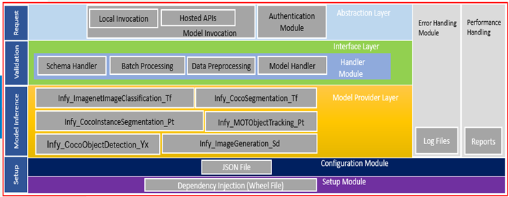
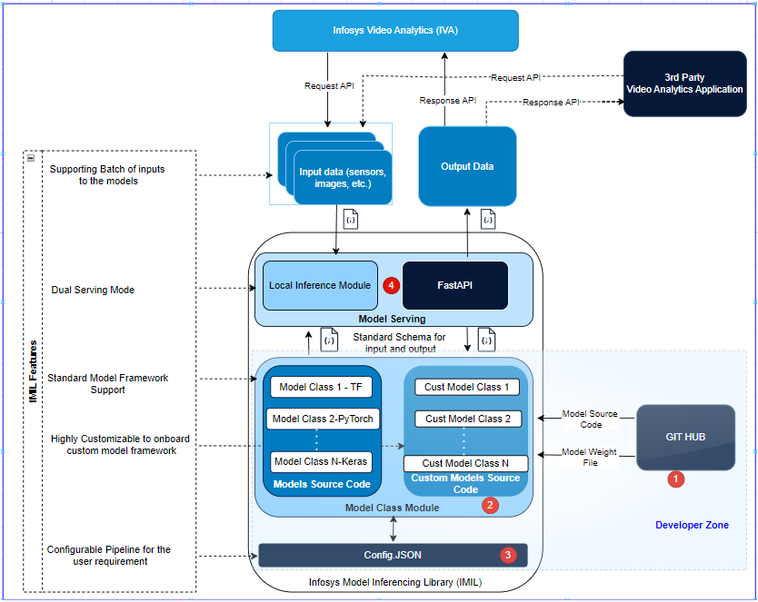

# Infosys Model Inference Library

## Overview

The Infosys Model Inference Library (IMIL) is a versatile and powerful tool designed to simplify the deployment and utilization of machine learning models, regardless of the framework or model type. IMIL is engineered to provide high performance and flexibility, enabling seamless integration and deployment of models in various environments.

## Purpose

IMIL serves as a bridge between machine learning models and their practical applications, catering to research, development, and production needs. By offering a unified framework that supports a wide range of models and deployment scenarios, IMIL empowers data scientists, AI researchers, and developers to deploy models efficiently and effectively.

## Overall Architecture



## IMIL Process Flow


## Benifits
- **Improved Efficiency**: The on-demand loading, and dual invocation modes enhance the efficiency of inference tasks, ensuring optimal resource utilization and faster response times.
- **Broad Applicability**: With its framework-agnostic design, batch processing capabilities, and extensive customization options, IMIL is suitable for a wide range of applications, from academic research to commercial AI solutions.
- **Developer-Friendly API**: IMIL provides intuitive and well-documented APIs, enabling developers to integrate models into their workflows without changing the payload. This reduces the learning curve and speeds up the development cycle.
- **Seamless Integration**: IMIL integrates easily with existing machine learning pipelines, tools, and platforms, offering developers flexibility and compatibility with their preferred environments, from local machines to cloud platforms.
- **Flexible Model Management**: Developers can effortlessly switch between multiple versions of models, run experiments, or deploy updates, reducing the overhead associated with managing model lifecycles.
- **Customizable Inference Pipelines**: Developers have control over custom inference pipelines tailored to their unique needs, offering flexibility without sacrificing performance.
- **Cross-Platform Support**: IMIL supports deployment on various platforms Windows, Linux allowing developers to target a range of environments with minimal adjustments.
- **Pre-built Integrations**: With support for pre-trained models and common machine learning frameworks, IMIL helps developers kickstart their projects without building models from scratch.
- **Ease of Deployment**: IMIL abstracts the complexities of model deployment, allowing users to focus on developing and refining their models rather than dealing with deployment intricacies.
- **Community and Support**: As an open-source library, IMIL benefits from community contributions and support, fostering continuous improvement and innovation.


## Installation Guide

### Prerequisites
- Git
- Python>=3.9

Make sure python is installed in the machine. If required, create a virtual environment and activate it.

### Setup Instructions
#### Cloning Git Repository
Clone the repository using the following command,
```bash
git clone https://github.com/Infosys/Infosys-Model-Inference-Library.git
cd Infosys-Model-Inference-Library
```

#### Creating python virtual environment and activating that environment (optional)
The below commands create a virtual environment and activate it in windows operating system. This step is optional, but it is recommended to create a virtual environment to avoid conflicts with the existing python environments.
```bash
python -m venv venv
cd venv/Scripts
activate.bat
cd ../..
pip install -r requirements.txt
```

#### Installing the dependencies for IMIL library
The following packages need to be installed for the Infosys Model Inference Library to work.

##### base packages
- opencv-python
- numpy
- pillow
- pyfiglet

##### Fast API
- bcrypt
- cryptography
- fastapi
- pydantic
- PyJWT
- python-jose
- python-multipart
- starlette
- uvicorn
- passlib

It can also be installed using the requirements.txt file.

```bash
pip install -r requirements.txt
```

#### Other Dependencies
Apart from the packages mentioned in the `Installing the dependencies for IMIL library` session, there are other dependency which are related to the model. All the packages required for the model to run should be installed. 

Refer to [SUPPORTED_MODELS.md](SUPPORTED_MODELS.md) for more details on the supported models and their dependencies, along with instructions to set up the those models to run with IMIL.

## Supported Models
Below are the list of model currently supported by the Infosys Model Inference Library. `Model Name` is the name that needs to be passed in the input JSON to run the model.

| S.No. | Usecase/Framwork Name            | Model Name                  | 
|-------|----------------------------------|-----------------------------|
| 1     | ObjectDetection - COCO - Detecto | CocoObjectDetection_De      | 
| 2     | ObjectDetection - COCO - Yolov5  | CocoObjectDetection_Y5      |
| 3     | ObjectDetection - COCO - Yolov7  | CocoObjectDetection_Y7      | 
| 4     | ObjectDetection - COCO - Yolov8  | CocoObjectDetection_Y8      |
| 5     | FacialExpresionRecognition       | FacialExpressionRecognition |
| 6     | PyTorch                          | Pytorch                     |
| 7     | TensorFlow                       | TensorFlow                  |

Further details about the supported models are in [SUPPORTED_MODELS.md](SUPPORTED_MODELS.md)

## Configuration Explanation

This session explains the parameters/configurations in the [mil_config.json](mil_config.json), which are required for setting up the models with Infosys Model Inference Library.

| Config Tag Name	 | Config Sub tag Name            | Description                                                                                                                                                                                         |
|------------------|--------------------------------|-----------------------------------------------------------------------------------------------------------------------------------------------------------------------------------------------------|
| ModelExecutor    | model_name                     | The name of the model that you are configuring to run. This name is the same as the name of the class the user is invoking and the Config tag in this config.ini file.                              |
|                  | 	model_loader_file             | 	This denotes the name of the model loader file, or in other words, the file that has the Model class definition. Use the value "default" for the model that IMIL supports.                         |
| FastAPI          | 	host                          | 	The host machine's IP address. Provide it as a string and not dot separated integers. In most cases it would be "0.0.0.0"                                                                          |
|                  | 	port	                         | The port used by Fast API to host the endpoint. Make sure the port number is not used by other application in your machine.                                                                         |
|                  | 	endpoint	                     | The endpoint of the FastAPI. This string value should be prefixed with a forward slash(/). For example "/PyTorchModelLoader". The API endpoint looks like ("http://"+host+":"+port+endpoint)        | 
| ModelLoader      | 	first_method_to_call_in_class | 	The main method that would be called after initializing the Model class                                                                                                                            | 
|                  | 	file_location                 | 	Path to the file mentioned in file_name                                                                                                                                                            | 
|                  | 	class_name	                   | Class that needs to be invoked in the file_name. Usually the same as model_name under ModelExecutor Config Tag                                                                                      |   
|                  | 	is_class	                     | Is it a class or not a class. Defaults to "yes"                                                                                                                                                     | 
| PyTorch          | 	name	                         | Name of the model.                                                                                                                                                                                  |
|                  | 	category	                     | category of the model. For example image_segmentation or image_classification, etc.                                                                                                                 | 
|                  | 	model_path	                   | A list that contains the path to the weight files.                                                                                                                                                  | 
|                  | 	class_names                   | 	The class names with which the model was trained on. Give ["imagenet"] if the model was trained on imagenet dataset.                                                                               | 
|                  | 	classes                       | 	The classes the user is interested in filtering. **For Example** specifying ["fire", "smoke"] gives the predictions of those classes alone and does not return any prediction for "neutral" image. |
|                  | input_image_size               | 	Input image size provided to the model. Example: [224,224]                                                                                                                                         | 
|                  | 	device	                       | A string mentioning in which device the model needs to be loaded. **For Example:** "cpu" or "cuda"                                                                                                  |                                                                                                                                                                                                                                                    |     |

## Testing the installation
This session is just for checking the installation of the Infosys Model Inference Library. For this test to work, the IMIL dependencies and the model dependencies should be installed properly. Refer [SUPPORTED MODELS.md](SUPPORTED_MODELS.md)

We have provided a file for testing the installation. Execute the [test.py](test.py) file by passing the below parameters, 
 - model - Name of the model you want to run
 - confidence - confidence threshold for the model
 - iteration - How many times do you want the model to run
 - image - references/people.jpg
 - prompt - Prompt for the model

The below command is just an example of for syntax.

```
python test.py --model CocoObjectDetection_De --confidence 0.5 --iteration 3 --image references/people.jpg --prompt "['fire', 'smoke', 'neutral']"
```

The above command will use [references/people.jpg](references/people.jpg) to run the `CocoObjectDetection_De` model for 3 times. The confidence threshold is set to 0.5. The output will be printed on the console.

The `prompt` parameter is used here just to show the usage of the prompt parameter in [test.py](test.py). The prompt parameter is not used for `CocoObjectDetection_De` model.

## Usage
### Basic Usage
#### Infosys Model Inference Library for hosting FastAPI

- For hosting the model as a FastAPI in Infosys Model Inference Library, make sure the details in [mil_config.json](mil_config.json) are configured properly. Three tags are significant in this configuration. Refer to the `Schema definition` session in this document for more clarity on the output schema structure.
  - ModelExecutor
  - ModelLoader
  - FastAPI and 
  - the tag of the model, the user wants to run (For Example: `CocoObjectDetection_De` for running a `ObjectDetection - COCO - Detecto` model).
- Run the `PythonModelExecutor.py` file, which will host the FastAPI.

```bash
python PythonModelExecutor.py
```

#### Infosys Model Inference Library as Local method call
- For invoking the model via local method call, make sure the details in [mil_config.json](mil_config.json) are configured properly. Three tags are significant in this configuration 
  - ModelExecutor
  - ModelLoader
  - the tag of the model, the user wants to run (For Example: `CocoObjectDetection_De` for running a `ObjectDetection - COCO - Detecto` model).
- Import the `executeModel()` method in `PythonModelExecutor.py` and pass the request schema to the method as a JSON and the method would return a response JSON. 
- Refer to the `Input Schema and Output Schema` session in this document for more clarity on the schema structure.
- Sample code for invoking the Infosys Model Inference Library as a local method call is provided below in the `Examples` section, in this document.


#### For Advanced usage and customization, refer to [README_ADVANCED.md](README_ADVANCED.md)

## Input Schema and Output Schema
### Sample for Input Schema
```json
{ 
"Tid": "1",
 "Did": "DeviceId",  
 "Fid": "1160",
 "Base_64": "",
 "C_threshold": 0.5,
 "Per": [],
 "Mtp":[
        {
	       "Etime": "2023-04-22,04:56:28.805 AM",
           "Src": "Grabber",
           "Stime": "2023-04-22,04:56:28.805 AM"
        },
        {
           "Etime": "",
           "Src": "Frame Processor",
           "Stime": "2023-04-22,04:56:41.860 AM"
         }
        ],
 "Ts": "",
 "Ts_ntp": "",
 "Inf_ver" :"",
 "Msg_ver": "",
 "Model": "CocoObjectDetection_De",
 "Ad": "" ,
 "Ffp": "ffp",
 "Ltsize": "ltsize",
 "Lfp": "lfp",
 "I_fn": " ", 
 "Msk_img": [" "],                         
 "Rep_img": [" "],
  "Prompt":[""]
 } 

```

### Sample for Output Schema 
```json
{
"Tid":"1",
"Did":"DeviceId",
"Fid":"1160",
"Fs":[
	{
	"Cs":1.0,
	"Lb":"person",
	"Dm":{"X":0.18560473,"Y":0.03351725,"H":0.93880859,"W":0.17927151},
	"Nobj":"",
	"Uid":"",
	"Info":"{}",
	"Kp":{}
	}
	],
"Mtp":[
	{"Etime":"08-02-2023,02:11:33.513PM","Src":"grabber","Stime":"08-02-2023,02:11:22.744PM"},
	{"Etime":"08-02-2023,02:11:33.513PM","Src":"predictor","Stime":"08-02-2023,02:11:22.744PM"},
	{"Etime":"2023-05-04,01:25:58.774PM","Src":"Detecto","Stime":"2023-05-04,01:25:56.974PM"}
	],
"Ts":"",
"Ts_ntp":"",
"Msg_ver":"",
"Inf_ver":"",
"Rc":"200",
"Rm":"Success",
"Ad":"",
"Lfp":"lfp",
"Ffp":"ffp",
"Ltsize":"ltsize",
"Obase_64": [""],                       
"Img_url": [""]
}
```

## Schema definition
| Key         | Description                                          | 
|-------------|------------------------------------------------------|
| Tid         | Tenant ID                                            |
| Did         | Device ID                                            | 
| Fid         | Frame ID                                             | 
| Base_64     | Base-64 encoding string of an image                  |
| C_threshold | Confidence threshold value. Data type is float       |
| Per         | Previous frame's metadata                            |
| Mtp         | Message Travel Path                                  | 
| Ts          | Time Stamp                                           |
| Ts_ntp      | NTP Time Stamp                                       | 
| Inf_ver     | Infosys Version                                      | 
| Msg_ver     | Message Version                                      |
| Model       | Name of the Model that is being triggered            |
| Ad          | Additional Parameters                                |
| Ffp         | First Frame passing                                  |   
| Ltsize      | Lot size                                             |
| Lfp         | Last Frame Passing                                   | 
| Fs          | It contains all the predicted output of the model    | 
| Rc          | Response Code. Denotes success or failure code       |
| Rm          | Response Message. Denotes success or failure message |
| I_fn        | Input file name                                      |
| Msk_img     | List of mask images                                  |   
| Rep_img     | Replaces images as a list                            |
| Prompt      | List of text prompts                                 | 
| Img_url     | List of urls of output images                        | 
| Obase_64    | List of output images in base64 format               |
   

## Examples
```python
# loading the required libraries
import json
from PythonModelExecutor import executeModel
from milutils.generalutils import image_to_base64

# Refer the "Input Schema and Output Schema" session in this document for more info on sample_input_json.
sample_input_json = {
    "Tid": "1",
    "Did": "DeviceId_11",
    "Fid": "1160",
    "C_threshold": 0.3,
    "Per": [],
    "Mtp": [
        {
            "Etime": "08-02-2023,02:11:33.513 PM",
            "Src": "frame grabber",
            "Stime": "08-02-2023,02:11:22.744 PM"
        }
    ],
    "Ts": "",
    "Ts_ntp": "",
    "Inf_ver": "",
    "Msg_ver": "",
    "Model": "<select the model from the list of supported models>",
    "Ad": "",
    "Ffp": "ffp",
    "Ltsize": "ltsize",
    "Lfp": "lfp",
    "Base_64": "<replace with base64 format of image>"
}

# Select the model name from the list of supported models, and assign it as sample_input_json["Model"]
sample_input_json["Model"] = "CocoObjectDetection_De"

# read the image, convert it into base64 format and store it inside the json variable as sample_input_json["Base_64"]
sample_input_json["Base_64"] = image_to_base64("references/people.jpg")

# execute the model
result = executeModel(json.dumps(sample_input_json))

# print the result, refer to the "Output Schema" session in this document for more info on the printed result structure.
print("Result : ", result)
```


## License
Apache License 2.0
